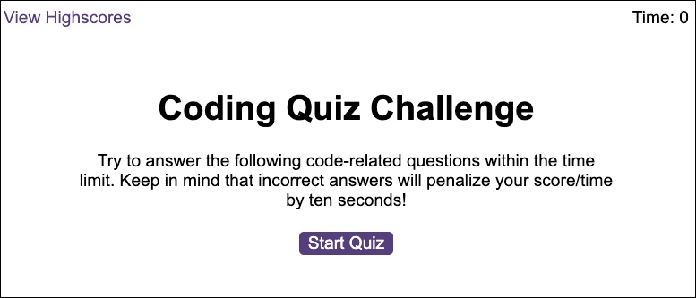

# Web APIs - Code Quiz

## Table of Contents
* [Description](#description)
* [User Story](#user-story)
* [Acceptance Criteria](#acceptance-criteria)
* [Technologies Used](#technologies-used)
* [Links and Screenshot](#links-and-screenshot)
* [License](#license)

## Description
This is a timed, coding assessment that includes a combination of multiple-choice questions and interactive challenges. This application runs in the browser and features dynamically updated HTML and CSS powered by JavaScript code.

## User Story
```
AS A coding bootcamp student
I WANT to take a timed quiz on JavaScript fundamentals that stores high scores
SO THAT I can gauge my progress compared to my peers
```

## Acceptance Criteria
```
GIVEN I am taking a code quiz
WHEN I click the start button
THEN a timer starts and I am presented with a question
WHEN I answer a question
THEN I am presented with another question
WHEN I answer a question incorrectly
THEN time is subtracted from the clock
WHEN all questions are answered or the timer reaches 0
THEN the game is over
WHEN the game is over
THEN I can save my initials and score
```

## Technologies Used
* HTML
* CSS
* JavaScript

## Links and Screenshot

* URL of the functional, deployed application: https://megancarnaghi.github.io/Web-APIs-Code-Quiz/

* URL of the GitHub repository: https://github.com/MeganCarnaghi/Web-APIs-Code-Quiz.git



## License


